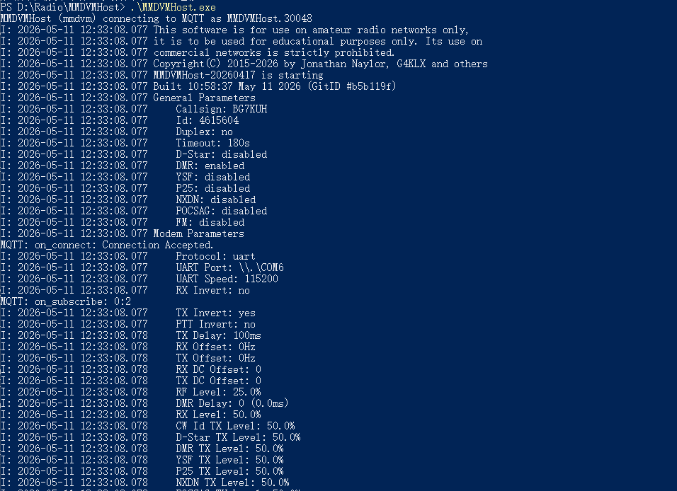

# MMDVMHost-Builds

Automated multi-platform builds of the upstream **MMDVMHost** project.

This repository contains **GitHub Actions workflows** that clone the upstream source at build time, compile binaries for several targets, then publish the results as **GitHub Release assets** whenever you push a version tag.



## Build targets

- Linux x86_64 (gcc)
- Linux x86_64 (clang)
- Linux arm64 (gcc, via QEMU container)
- Windows x86 (MSVC, static)
- Windows x64 (MSVC, static)

## How it works

At a high level, the workflow does this:

1. **Trigger**
	- Runs on `workflow_dispatch` (manual) and on `push` of tags matching `v*` (for example `v0.1.0`).
2. **Build jobs (matrix)**
	- Linux builds run on `ubuntu-22.04`.
	- Linux `arm64` is built via **QEMU** using a container.
	- Windows builds run on `windows-2022` using **MSBuild**.
3. **Dependencies**
	- Linux installs required dev packages via `apt`.
	- Windows installs libraries via `vcpkg` and builds with static triplets.
4. **Artifacts**
	- Each job uploads an artifact containing the binary plus a `build.log`.
5. **Release publishing**
	- A final job downloads all artifacts and uploads them to the GitHub Release.
	- Release asset filenames are made unique by prefixing them with the artifact name (so multiple `MMDVMHost`/`build.log` files don’t overwrite each other).

Windows builds use static vcpkg triplets so the resulting `MMDVMHost.exe` typically does not require shipping extra runtime DLLs alongside it.

## Create a release

Push a tag that starts with "v" (for example, v0.1.0). The workflow will build all targets and upload the artifacts to a GitHub Release under that tag.

Example:

```powershell
git tag v0.1.0
git push origin v0.1.0
```

When the workflow finishes, open the Release page for that tag and download the asset that matches your platform.

### What you will see on the Release page

You should expect multiple assets, typically including:

- Linux binaries named like `mmdvmhost-linux-x86_64-gcc-MMDVMHost`, `mmdvmhost-linux-arm64-gcc-MMDVMHost`, etc.
- Windows binaries named like `mmdvmhost-windows-x64-MMDVMHost.exe` and `mmdvmhost-windows-x86-MMDVMHost.exe`
- Per-target logs named like `mmdvmhost-<target>-build.log`

## Usage

### Using the prebuilt binaries (recommended)

1. Download the correct asset from Releases.
2. Put the binary alongside your configuration file (for example `MMDVMHost.ini`).
3. Run it:

**Linux**

```bash
chmod +x ./mmdvmhost-linux-x86_64-gcc-MMDVMHost
./mmdvmhost-linux-x86_64-gcc-MMDVMHost MMDVMHost.ini
```

**Windows (PowerShell)**

```powershell
./mmdvmhost-windows-x64-MMDVMHost.exe MMDVMHost.ini
```

If you rename the downloaded asset back to `MMDVMHost` or `MMDVMHost.exe`, the commands become the “classic”:

```powershell
MMDVMHost.exe MMDVMHost.ini
```

### Building your own releases

- Fork this repo.
- (Optional) Adjust targets or toolchains in `.github/workflows/build.yml`.
- Push a `v*` tag to publish a new release.

## Notes

- The upstream source is not stored in this repo; it is cloned during CI.
- MMDVMHost still expects a valid config file at runtime (for example `MMDVMHost.ini`).
